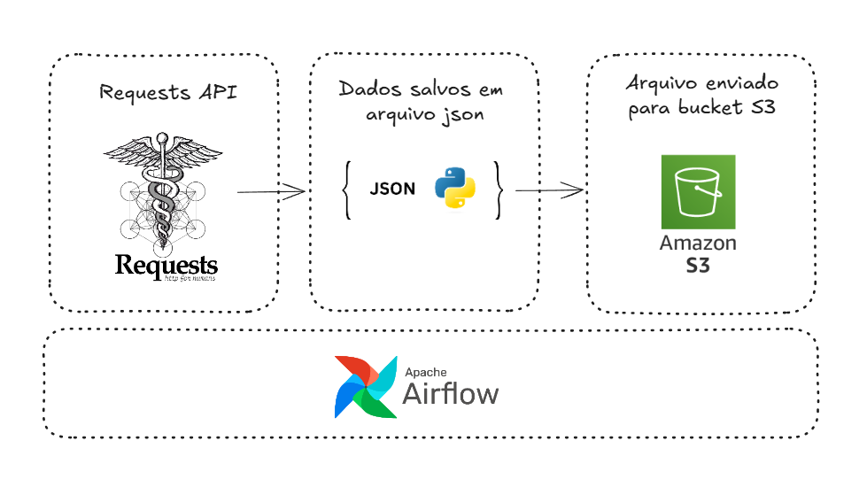

# 🔍 PokéAPI Data Fetcher

Uma aplicação em Python que consome a [PokéAPI](https://pokeapi.co/) para buscar informações de Pokémon como **ID**, **nome**, **peso**, **altura** e **tipo(s)** usando a biblioteca `requests`.

## 🚀 Funcionalidades

- 🔗 Consumo da API RESTful da PokéAPI
- 📦 Retorno estruturado com informações úteis sobre os Pokémon
- 🔄 Suporte para múltiplos Pokémon em sequência
- ✅ Fácil de estender e adaptar (ex: salvar em CSV, JSON ou banco de dados)

## 🌬️ Orquestração com Apache Airflow

Este projeto utiliza o **Apache Airflow** para automatizar e orquestrar o fluxo de dados:

1. **Requisição de dados da PokéAPI**
2. **Armazenamento dos dados em um arquivo `.json` local**
3. **Envio automático desse arquivo para um bucket S3 da AWS**

### 📋 Como funciona o fluxo (DAG)

A DAG do Airflow é responsável por:

- 📥 **Baixar os dados** de diversos Pokémon usando a PokéAPI
- 🧾 **Salvar os dados** estruturados em um arquivo `.json`
- ☁️ **Enviar o arquivo** para um bucket S3 (usando `boto3`)

## 🧠 Como funciona

O script envia requisições GET para o endpoint da PokéAPI para cada Pokémon e extrai os campos desejados, salva em um arquivo .json e envia para um bucket S3 na AWS:

- id: identificador do Pokémon
- name: nome
- height: altura
- weight: peso
- types: lista de tipos (ex: Grass, Fire, Water)

